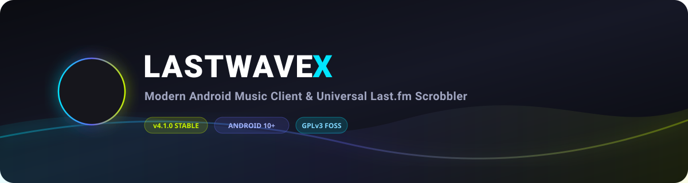

<div align="center">



# LASTWAVEX

**Next-Gen Android YouTube Music Client & Universal Last.fm Scrobbler with Real-Time Synced Lyrics, Smart Algorithmic Mixes, and Local Offline Music Storage.**

<p align="center">
  <a href="#">
    
  </a>
  <a href="#">
    
  </a>
  <a href="#">
    
  </a>
  <a href="#">
    
  </a>
</p>

</div>

<br/>


## Product Overview

**LASTWAVEX** (`com.specttre404.lastwavex`) is an open-source, native Android music application built for listeners who value algorithmic music discovery, audio playback, kinetic visual feedback, and transparent local data management.

Powered by the YouTube Music catalog and Last.fm scrobbling infrastructure, LASTWAVEX delivers background streaming without in-app ad units, real-time synchronized karaoke lyrics, personalized recommendation feeds, and a background media scrobbler in a refined **Material 3 Expressive** interface.

---

## What Makes LASTWAVEX Different

- **Public Endpoint Client:** Stream direct from public audio endpoints without proprietary intermediate servers or user tracking.
- **Background Scrobbler:** Watches system media sessions locally and submits scrobbles to Last.fm across supported music players installed on your phone.
- **Offline First & Local Storage:** Music, downloaded LRC lyrics, playlists, and listening statistics are stored transparently on your device (`Music/LastWave`).
- **No Monetization Paywalls:** Free software without ads, subscription tiers, locked settings, or artificial feature gating.

---

## Implemented Features

### 🎵 Streaming & Audio Engine
- **YouTube Music Catalog:** Stream tracks, albums, artists, and public playlists with background playback and no in-app ad units.
- **Audio Pipeline:** Native AndroidX Media3 ExoPlayer engine with Opus audio streams, software FFmpeg decoding fallback, and Oboe low-latency native output.
- **Media Controls:** System notification controls, Android Auto media browser, and lockscreen playback integration.

### 📊 Discovery & Smart Radio
- **Instant Radio & Mixes:** Algorithmic radios generated from seed artists, listened tracks, and user taste profiles.
- **Top Artists Charts:** Global and country-specific top artist rankings.
- **Taste Profile & Genres:** Genre breakdowns and personal listening statistics.

### 🎙️ Lyrics & Customization
- **LRCLIB Synced Lyrics:** Millisecond-synchronized karaoke lyrics with customizable animation motions.
- **Material 3 Expressive UI:** Dynamic wallpaper theming, album art accent color extraction, fluid card animations, and tactile haptic feedback.

### 📥 Storage & Export
- **Offline Downloader:** One-tap track downloads saved to local storage with embedded cover art and synchronized `.lrc` files.
- **Playlist Management & CSV Export:** Create local playlists, import public links, and export playlist metadata to UTF-8 CSV files.

---

## Technical Foundation

- **Language:** 100% Kotlin
- **UI Framework:** Jetpack Compose with Material 3 Expressive components
- **Audio Pipeline:** AndroidX Media3 ExoPlayer, MediaSessionCompat, Jellyfin FFmpeg decoder
- **Persistence & DI:** Room Database, Jetpack DataStore Preferences, Dagger Hilt
- **Network & Parsing:** Retrofit 2, OkHttp 4, Kotlinx Serialization, QuickJS Android runtime
- **Lyrics Engine:** LRCLIB API client

---

## Vision & Philosophy

LASTWAVEX is guided by core open-source principles:

1. **FOSS First:** Free and open-source software built for user empowerment.
2. **User Control:** Transparent configuration without hidden background telemetry.
3. **No Artificial Tiers:** Every capability is available to all users out of the box.
4. **Privacy-Conscious:** Designed to communicate directly with public service endpoints (YouTube Music, Last.fm, LRCLIB) without intermediate proprietary analytics or tracking servers.

---

## Project Roadmap

| Feature Area | Status | Focus & Objectives |
|:---|:---:|:---|
| **Local Playlist Management** | `Planned` | Expanded local playlist ordering, metadata editing, and import options. |
| **Offline Sync Enhancements** | `Planned` | Offline LRC lyrics synchronization and cached metadata validation. |
| **Theme & Equalizer Options** | `Exploring` | Custom theme color preset exports and equalizer audio routing options. |
| **Adaptive Multi-Pane Layout** | `Under consideration` | Multi-pane layout optimizations for large screen and tablet form factors. |

---

## Features We Intentionally Do Not Pursue

To keep LASTWAVEX lightweight, focused, and secure, the project explicitly excludes:

- ❌ **Commercial Subscriptions / Freemium Locks:** All features remain permanently free.
- ❌ **In-App Advertisements:** Zero ad banners, video popups, or promotional trackers.
- ❌ **Competitor Service Account Lock-In:** Unnecessary competitor account integrations that require sharing private credentials.
- ❌ **Heavy Social Networks:** Bloated social feeds, chat rooms, or messaging features outside music tracking.
- ❌ **Plugin / Executable Extensions:** Security risks associated with loading unverified remote executable scripts.

---

## Why This Project Exists

LASTWAVEX is a clean-room re-engineered fork created to modernize the codebase, establish strict compile-time dependency isolation, enforce release signing integrity, and deliver an ad-free music experience with transparent local data control.

---

## System Requirements & Installation

- **Minimum Version:** Android 10.0+ (API Level 29)
- **Target Version:** Android 15 (API Level 35)

### Installation
1. Download `app-release.apk` from the official **[Releases](https://github.com/specttre404/LastWaveX/releases)** page.
2. Install the APK on your Android device.
3. Optional: Connect your Last.fm account in **Settings → Integrations** to enable scrobbling and global stats.

---

## Building from Source

```bash
# Clone the repository
git clone https://github.com/specttre404/LastWaveX.git
cd LastWaveX

# Build debug variant
./gradlew app:assembleDebug

# Build minified release variant
./gradlew app:assembleRelease
```

Generated APK Artifacts:
- **Debug APK:** `app/build/outputs/apk/debug/app-debug.apk`
- **Release APK:** `app/build/outputs/apk/release/app-release.apk`

---

## Current Release Information

- **Release Tag:** `v4.1.0`
- **Recommended Artifact:** `app-release.apk` *(Size: ~23.0 MB, minified & R8 shrunk)*
- **SHA-256 Checksum:**
  `7A1BD12DC1585003AE4B1479ACE9E01C8400EB1577641DB7CB9B940AEDF84DAC`

---

## Credits & Upstream Acknowledgments

LASTWAVEX is built upon open-source Android music architecture and community projects:

- **[LastWave](https://github.com/Clash-Projects/LastWave-native)** — Original open-source reference project and UI inspiration.
- **[InnerTubeX](https://github.com/metrolist/innertubex)** — InnerTube YouTube Music API client adapter.
- **[NewPipe Extractor](https://github.com/TeamNewPipe/NewPipeExtractor)** — YouTube metadata extraction library.
- **[LRCLIB](https://lrclib.net)** — Synced lyrics database service.
- **[Media3 FFmpeg Decoder](https://github.com/jellyfin/jellyfin-ffmpeg)** — High-fidelity software audio decoding.

---

## Disclaimer

> [!NOTE]
> **Educational & Research Notice**
>
> LASTWAVEX is an open-source, non-commercial application developed for educational, research, and personal use to demonstrate modern Android Media3 architecture and Jetpack Compose design patterns.
>
> **Notice of Non-Affiliation**
> - LASTWAVEX is an independent community project and is **not affiliated with, endorsed, or sponsored by Google LLC, YouTube, YouTube Music, Last.fm, or any music streaming provider**.
> - LASTWAVEX **does not host, store on private servers, or distribute copyrighted audio files**. All media content is streamed directly from public web endpoints under fair research and personal use. All trademarks belong to their respective owners.

---

## License

This project is licensed under the **GNU General Public License v3.0 (GPLv3)** — see the [`LICENSE`](LICENSE) file for details.

<div align="center">
  <p><b>LASTWAVEX</b> — Free &amp; Open Source Software for Android</p>
</div>
